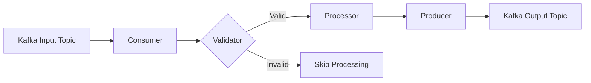
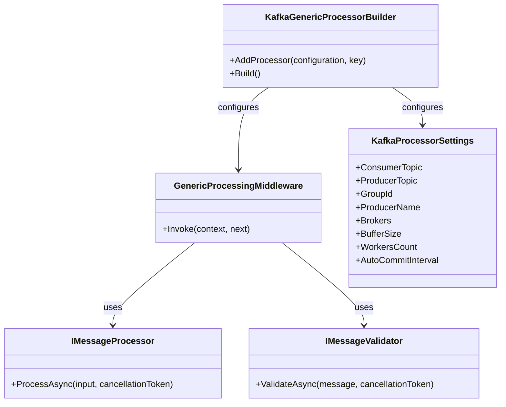
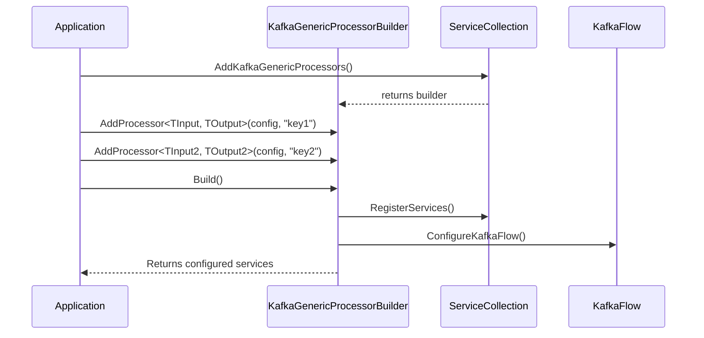
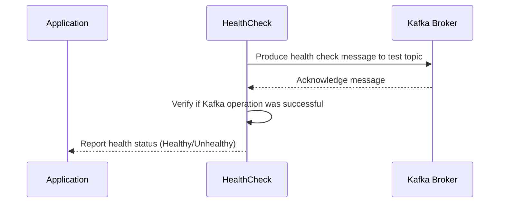

# KafkaGenericProcessor.Core

A flexible, extensible library built on top of KafkaFlow to simplify the development of Kafka message processing applications in .NET. This library provides a standardized way to handle message validation, processing, and producing with minimal boilerplate code.

## Table of Contents

- [Overview](#overview)
- [Architecture](#architecture)
- [Flow Diagrams](#flow-diagrams)
- [Key Components](#key-components)
- [Installation](#installation)
- [Configuration](#configuration)
  - [Matching Configuration Keys](#matching-configuration-keys)
- [Usage](#usage)
  - [Basic Implementation](#basic-implementation)
  - [Multiple Processors](#multiple-processors)
  - [Custom Validators](#custom-validators)
- [Health Checks](#health-checks)
  - [Health Check Implementation](#health-check-implementation)
  - [Health Check Configuration](#health-check-configuration)
  - [Health Endpoints](#health-endpoints)
- [Extensibility Points](#extensibility-points)
- [Advanced Scenarios](#advanced-scenarios)
- [Examples](#examples)

## Overview

KafkaGenericProcessor.Core simplifies the process of creating Kafka consumers and producers that validate, transform, and forward messages. It provides a middleware-based approach built on KafkaFlow, with a fluent API for easy configuration of multiple processing pipelines.

The library enables:

- **Type-safe message processing** - Strongly-typed interfaces for both input and output messages
- **Validation** - Built-in message validation with customizable validators
- **Transformation** - Process and enrich messages before sending to output topics
- **Health monitoring** - Integration with .NET's health check system
- **Fluent Configuration** - Simple builder pattern for clean configuration

## Architecture

KafkaGenericProcessor.Core follows a middleware-oriented design philosophy, where messages flow through a pipeline of processors. The library integrates with KafkaFlow's middleware pattern and adds additional abstractions to simplify common tasks.

The core architecture consists of:

1. **Input Messages** - Messages consumed from configured Kafka topics
2. **Validators** - Components that verify if a message should be processed
3. **Processors** - Business logic that transforms input messages to output messages
4. **Producers** - Components that send processed messages to output topics

## Flow Diagrams

### Message Processing Flow



### Component Relationships



### Registration and Configuration Flow



## Key Components

### IMessageProcessor<TInput, TOutput>

The core interface for transforming input messages to output messages.

```csharp
public interface IMessageProcessor<TInput, TOutput>
{
    Task<TOutput> ProcessAsync(TInput input, CancellationToken cancellationToken = default);
}
```

### IMessageValidator<T>

Interface for validating incoming messages before processing.

```csharp
public interface IMessageValidator<T>
{
    Task<bool> ValidateAsync(T message, CancellationToken cancellationToken = default);
}
```

### GenericProcessingMiddleware

KafkaFlow middleware that orchestrates the validation, processing, and producing of messages.

### KafkaGenericProcessorBuilder

Fluent API for configuring multiple processors in a clean, readable manner.

## Installation

Add the KafkaGenericProcessor.Core package to your project:

```bash
dotnet add package KafkaGenericProcessor.Core
```

## Configuration

Configure your `appsettings.json` with the following structure:

```json
{
  "Kafka": {
    "Configurations": {
      "processorKey1": {
        "ConsumerTopic": "input-topic-1",
        "ProducerTopic": "output-topic-1",
        "GroupId": "consumer-group",
        "ProducerName": "message-producer",
        "Brokers": ["kafka:9092"],
        "BufferSize": 100,
        "WorkersCount": 10,
        "AutoCommitInterval": "00:00:05"
      },
      "processorKey2": {
        "ConsumerTopic": "input-topic-2",
        "ProducerTopic": "output-topic-2",
        "GroupId": "consumer-group",
        "ProducerName": "message-producer",
        "Brokers": ["kafka:9092"],
        "BufferSize": 100,
        "WorkersCount": 10,
        "AutoCommitInterval": "00:00:05"
      }
    }
  }
}
```

### Matching Configuration Keys

One of the most important aspects of the KafkaGenericProcessor.Core library is the **key-based binding** between the following components:

1. **Configuration keys** in `appsettings.json` under `Kafka:Configurations`
2. **Processor keys** used in the `AddProcessor<TInput, TOutput>()` method
3. **Keyed service registration** with `AddKeyedTransient`, `AddKeyedScoped`, etc.

This key-based approach provides several benefits:

- **Isolation**: Each processor pipeline is completely isolated and can have its own settings
- **Flexibility**: Multiple processors can share the same input/output types but with different implementations
- **Clarity**: Clear relationship between configuration and implementation components

#### Key Binding Example

Here's a diagram showing the relationship between these elements:

```mermaid
graph TD
    A[appsettings.json<br>Kafka:Configurations:mykey1] -->|Same Key| B[AddProcessor<TInput, TOutput><br>config, "mykey1"]
    B -->|Same Key| C[AddKeyedTransient<br>IMessageProcessor, "mykey1"]
    B -->|Same Key| D[AddKeyedTransient<br>IMessageValidator, "mykey1"]
    A -.->|References| E[ConsumerTopic: "input-topic"]
    A -.->|References| F[ProducerTopic: "output-topic"]
    C -.->|Processes Messages| E
    C -.->|Produces To| F
```

#### Code Example of Key Matching

```csharp
// 1. Configuration in appsettings.json
// "Kafka": {
//   "Configurations": {
//     "order-processor": { ... }
//   }
// }

// 2. Register services with matching key
builder.Services.AddKeyedTransient<IMessageProcessor<OrderInput, OrderOutput>, OrderProcessor>("order-processor");
builder.Services.AddKeyedTransient<IMessageValidator<OrderInput>, OrderValidator>("order-processor");

// 3. Configure processor with the same key
builder.Services.AddKafkaGenericProcessors()
    .AddProcessor<OrderInput, OrderOutput>(builder.Configuration, "order-processor")
    .Build();
```

> **WARNING**: Using different keys for configuration and service registration will result in services not being found at runtime, leading to runtime exceptions. Always ensure your keys match across all components.

## Usage

### Basic Implementation

1. Define your input and output message classes:

```csharp
public class MyInput
{
    public string Id { get; set; }
    public string Data { get; set; }
}

public class MyOutput
{
    public string EnrichedId { get; set; }
    public string ProcessedData { get; set; }
    public DateTime ProcessedAt { get; set; }
}
```

2. Create an implementation of `IMessageProcessor<TInput, TOutput>`:

```csharp
public class MyInputProcessor : IMessageProcessor<MyInput, MyOutput>
{
    public Task<MyOutput> ProcessAsync(MyInput input, CancellationToken cancellationToken = default)
    {
        return Task.FromResult(new MyOutput
        {
            EnrichedId = $"ENRICHED-{input.Id}",
            ProcessedData = $"Processed: {input.Data}",
            ProcessedAt = DateTime.UtcNow
        });
    }
}
```

3. Optional: Create a custom validator:

```csharp
public class MyInputValidator : IMessageValidator<MyInput>
{
    public Task<bool> ValidateAsync(MyInput message, CancellationToken cancellationToken = default)
    {
        // Only process messages with IDs that start with 'A'
        return Task.FromResult(message.Id.StartsWith("A"));
    }
}
```

4. Register and configure services in your Program.cs:
> IMPORTANT: the keyed services name that you register must match the Kafka Configuration keys in you `appsettings.json` file

```csharp
// Register your processor and validator with the key "enrich1"
builder.Services.AddKeyedTransient<IMessageProcessor<MyInput, MyOutput>, MyInputProcessor>("processorKey1");
builder.Services.AddKeyedTransient<IMessageValidator<MyInput>, MyInputValidator>("processorKey1");

// Configure the Kafka processor
builder.Services.AddKafkaGenericProcessors()
    .AddProcessor<MyInput, MyOutput>(builder.Configuration, "processorKey1")
    .Build();

// Add health checks
builder.Services.AddKafkaGenericProcessorHealthChecks();

// In the app configuration section:
var kafkaBus = app.Services.CreateKafkaBus();
await kafkaBus.StartAsync();
```

### Multiple Processors

The fluent API makes it easy to configure multiple processors:

```csharp
builder.Services.AddKafkaGenericProcessors()
    .AddProcessor<MyInput, MyOutput>(builder.Configuration, "processorKey1")
    .AddProcessor<MyInput, MyOutput>(builder.Configuration, "processorKey2")
    .Build();
```

### Custom Validators

The library has a default validator that always returns `true`, but you can provide custom validators for your specific needs.

```csharp
// Validator for messages with min length and a specific ID prefix
public class MyInputValidator2 : IMessageValidator<MyInput>
{
    public Task<bool> ValidateAsync(MyInput message, CancellationToken cancellationToken = default)
    {
        return Task.FromResult(
            !string.IsNullOrEmpty(message.Data) && 
            message.Data.Length > 10 &&
            message.Id.StartsWith("B"));
    }
}

// Register with key
builder.Services.AddKeyedTransient<IMessageValidator<MyInput>, MyInputValidator2>("processorKey1");
```

## Health Checks

The library includes a comprehensive health check system that integrates with .NET's health check infrastructure to monitor the health of your Kafka connections, producers, and consumers.

### Health Check Implementation

KafkaGenericProcessor.Core includes the following health check mechanisms:

1. **Connection Health**: Verifies connectivity to Kafka brokers
2. **Producer Health**: Ensures producers can publish messages to the health check topic
3. **Consumer Health**: Verifies consumers can read messages from their assigned topics

The health checks are implemented using a ping-pong mechanism:



### Health Check Configuration

The health checks are automatically configured when you call `AddKafkaGenericProcessorHealthChecks()`. Under the hood, this method:

1. Creates a dedicated health check topic (`kafka-health-check` by default)
2. Configures a producer for sending health check messages
3. Registers health checks with appropriate tags for ready/live status

```csharp
// Health check registration detail
public static IServiceCollection AddKafkaGenericProcessorHealthChecks(
    this IServiceCollection services)
{
    services.AddHealthChecks()
        .AddCheck<KafkaConnectionHealthCheck>(
            "kafka-connection", 
            tags: new[] { "ready", "live" })
        .AddCheck<KafkaProducerHealthCheck>(
            "kafka-producer", 
            tags: new[] { "ready" });
    
    return services;
}
```

### Health Endpoints

The library supports different health check endpoints for different purposes:

#### Liveness Check

Verifies if the application is running and not deadlocked:

```csharp
app.MapHealthChecks("/health/live", new HealthCheckOptions
{
    Predicate = check => check.Tags.Contains("live"),
    ResponseWriter = UIResponseWriter.WriteHealthCheckUIResponse
});
```

#### Readiness Check

Verifies if the application is ready to accept requests and communicate with Kafka:

```csharp
app.MapHealthChecks("/health/ready", new HealthCheckOptions
{
    Predicate = check => check.Tags.Contains("ready"),
    ResponseWriter = UIResponseWriter.WriteHealthCheckUIResponse
});
```

#### Comprehensive Check

Provides a complete health status of all components:

```csharp
app.MapHealthChecks("/health", new HealthCheckOptions
{
    ResponseWriter = UIResponseWriter.WriteHealthCheckUIResponse
});
```

#### Health Check Response Example

```json
{
  "status": "Healthy",
  "totalDuration": "00:00:00.1337001",
  "entries": {
    "kafka-connection": {
      "data": {
        "brokers": ["kafka:9092"]
      },
      "duration": "00:00:00.0456789",
      "status": "Healthy",
      "tags": ["ready", "live"]
    },
    "kafka-producer": {
      "data": {
        "topic": "kafka-health-check",
        "producerName": "producer"
      },
      "duration": "00:00:00.0880212",
      "status": "Healthy",
      "tags": ["ready"]
    }
  }
}
```

### Integration with Kubernetes

The health check endpoints work seamlessly with Kubernetes probes:

```yaml
livenessProbe:
  httpGet:
    path: /health/live
    port: 80
  initialDelaySeconds: 10
  periodSeconds: 15
readinessProbe:
  httpGet:
    path: /health/ready
    port: 80
  initialDelaySeconds: 15
  periodSeconds: 30
```

## Extensibility Points

The library is designed to be extended in multiple ways:

1. **Custom Processors** - Implement `IMessageProcessor<TInput, TOutput>` for your domain logic
2. **Custom Validators** - Implement `IMessageValidator<T>` for custom validation rules
3. **Custom Middleware** - Add additional middleware to the KafkaFlow pipeline

### Error Handling

The GenericProcessingMiddleware includes error handling for both processing and producing errors:

1. If validation fails, the message is simply skipped
2. If processing throws an exception, it's caught and logged
3. If producing the output message fails, the error is caught and logged

## Examples

See the sample project in this repository for complete working examples:

- **Enricher.Sample** - A sample application with two processors and validators

### Testing Producers

You can use the test endpoints to manually trigger message production for testing:

```csharp
// Example test endpoint for processor1
app.MapGet("/test-input-enrich1", async (IProducerAccessor producerAccessor, IOptionsMonitor<KafkaProcessorSettings> optionsMonitor) =>
{
    var kafkaSettings = optionsMonitor.Get("enrich1");
    var testMessage = new MyInput("A123", "Test message");
    
    // Use the named producer based on the processor key
    string producerName = $"{kafkaSettings.ProducerName}_enrich1";
    var producer = producerAccessor.GetProducer(producerName);
    
    if (producer == null)
    {
        return Results.Problem($"Producer '{producerName}' not found");
    }
    
    var result = await producer.ProduceAsync(kafkaSettings.ConsumerTopic, Guid.NewGuid().ToString(), testMessage);
    return Results.Ok(new { Result = result, Topic = kafkaSettings.ConsumerTopic, Producer = producerName });
});
```