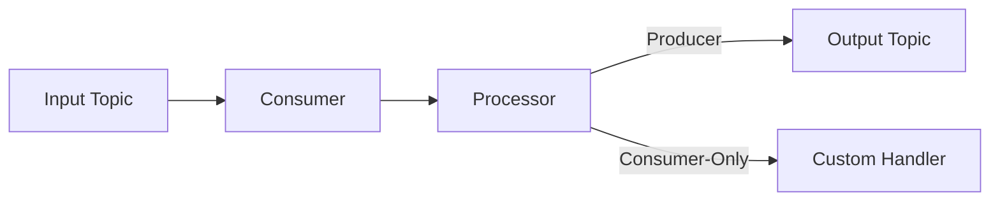

# KafkaGenericProcessor.Core

A .NET library for building Kafka (and Azure Event Hub) message processing pipelines with minimal boilerplate, using a middleware approach.

---

## Producing Messages Programmatically

To produce messages directly from your application code, use the `IProducerAccessor` to access a producer by name and send messages.

```csharp
app.MapPost("/api/produce", async (Input input, IProducerAccessor producerAccessor) =>
{

    var producerName = $"producer-{producerTopic}-{processorKey}";
    var producer = producerAccessor.GetProducer(producerName);
    await producer.ProduceAsync(input.Id, input);
    return Results.Ok(new { message = "Track sent successfully" });
});
```

- The producer name follows the convention: `producer-{ProducerTopic}-{processorKey}`.
- Use the accessor to get the producer and call `ProduceAsync(key, message)`.

---

For more, see the sample projects in this repository.

### Installation

```bash
dotnet add package KafkaGenericProcessors.Core
```

### Minimal Configuration

**appsettings.json**

```json
{
  "Kafka": {
    "Configurations": {
      "my-processor": {
        "ConsumerTopic": "input-topic",
        "ProducerTopic": "output-topic",
        "GroupId": "consumer-group",
        "Brokers": ["kafka:9092"]
      }
    }
  }
}
```

### Registering a Processor

```csharp
// Register your processor with the key "my-processor"
builder.Services.AddKeyedTransient<IMessageProcessor<MyInput, MyOutput>, MyProcessor>("my-processor");

// Configure the Kafka processor
builder.Services.AddKafkaGenericProcessors(builder.Configuration)
    .AddConsumerProducerProcessor<MyInput, MyOutput>("my-processor")
    .Build();

// Start processing
var kafkaBus = app.Services.CreateKafkaBus();
await kafkaBus.StartAsync();
```

---

## Internal Flow



- **Producer pipeline:** Input Topic → Consumer → Processor → Producer → Output Topic
- **Consumer-only pipeline:** Input Topic → Consumer → Processor (no output topic)

---

## Configuration

- **Key-based binding:** The key in `appsettings.json` must match the key in service registration and processor builder.

**Example:**

```json
// appsettings.json
"Kafka": {
  "Configurations": {
    "my-processor": { ... }
  }
}
```

```csharp
// Service registration
builder.Services.AddKeyedTransient<IMessageProcessor<MyInput, MyOutput>, MyProcessor>("my-processor");
builder.Services.AddKafkaGenericProcessors(builder.Configuration)
    .AddConsumerProducerProcessor<MyInput, MyOutput>("my-processor")
    .Build();
```

---

## Health

Add the following to your `appsettings.json` to configure the health check topic and brokers:

```json
"Kafka": {
  "Configurations": {
    "healthcheck": {
      "Brokers": ["kafka:9092"],
      "ProducerTopic": "kafka-health-check"
    }
  }
}
```

Expose health endpoints in your application:

```csharp
app.MapHealthChecks("/health/live", new HealthCheckOptions
{
    Predicate = check => check.Tags.Contains("live"),
    ResponseWriter = UIResponseWriter.WriteHealthCheckUIResponse
});
app.MapHealthChecks("/health/ready", new HealthCheckOptions
{
    Predicate = check => check.Tags.Contains("ready"),
    ResponseWriter = UIResponseWriter.WriteHealthCheckUIResponse
});
app.MapHealthChecks("/health", new HealthCheckOptions
{
    ResponseWriter = UIResponseWriter.WriteHealthCheckUIResponse
});
```

---

## Extensibility

- Implement custom processors by inheriting `IMessageProcessor<TInput, TOutput>` or `IConsumerOnlyProcessor<TInput>`.
- Disable health checks with `.DisableHealthCheck()` on the builder.

---

## Examples

### Minimal Example

```csharp
public class MyInput { public string Id { get; set; } }
public class MyOutput { public string Result { get; set; } }

public class MyProcessor : IMessageProcessor<MyInput, MyOutput>
{
    public Task<MyOutput> ProcessAsync(MyInput input, CancellationToken cancellationToken = default)
        => Task.FromResult(new MyOutput { Result = $"Processed {input.Id}" });
}
```

### Multi-Processor Example

```csharp
builder.Services.AddKafkaGenericProcessors(builder.Configuration)
    .AddConsumerProducerProcessor<MyInput, MyOutput>("proc1")
    .AddConsumerProducerProcessor<MyInput, MyOutput>("proc2")
    .Build();
```

### Consumer-Only Example

```csharp
builder.Services.AddKeyedTransient<IConsumerOnlyProcessor<MyInput>, MyConsumerOnlyProcessor>("consumer-only-key");
builder.Services.AddKafkaGenericProcessors(builder.Configuration)
    .AddConsumerProcessor<MyInput>("consumer-only-key")
    .Build();
```

### Add a Producer Only

```csharp

builder.Services.AddKafkaGenericProcessors(builder.Configuration)
    .AddProducer("producer-only-key")
    .AddProducer("another-producer-key")
    .Build();
```
